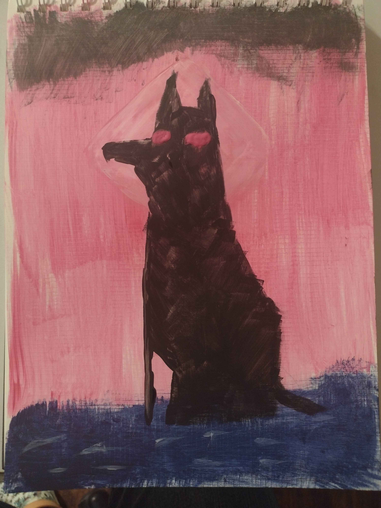
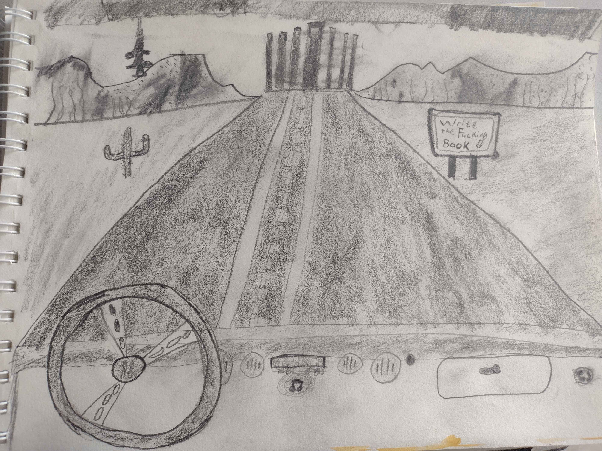
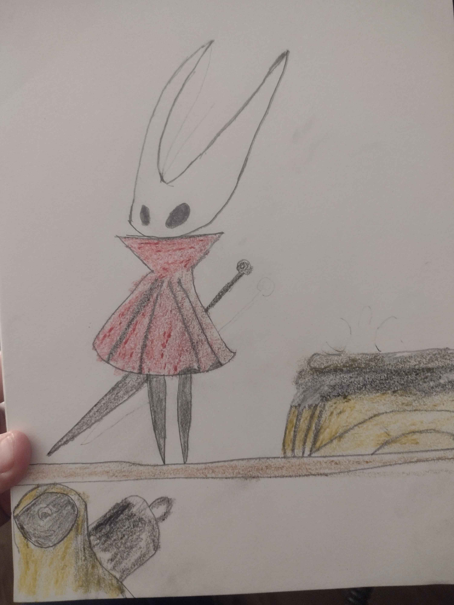
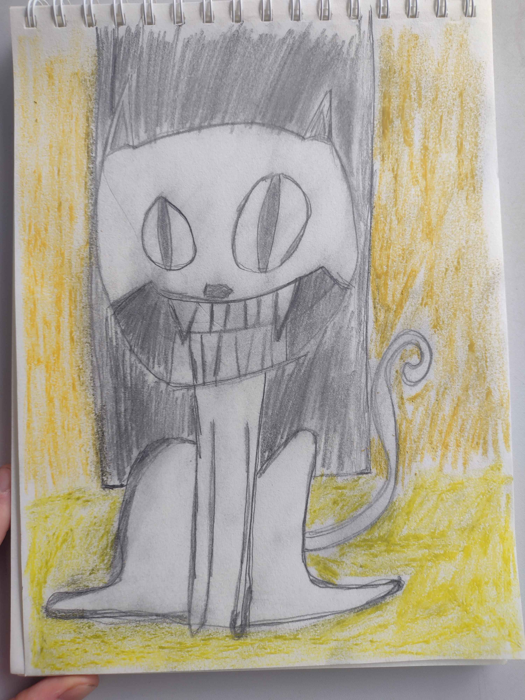

# Art Pieces

## Physical Media

**The Jackal**
This is an acrylic piece I did in memory of one of my favorite games, Hyper Light Drifter. This is my representation of the jackal that guides you throughout the game. What they are is uncertain, though it seems that they want the Drifter to help free them from some sort of imprisonment, however they never give the help that the eponymous Drifter or any of their colleagues need. 

**Heatstroke**
This is a sketch of the only thing you'll ever see in this game that's more like a test of endurance than anything else. You have to drive a car through an endless desert and write (its more typing out) a book. Are these two things even related to each other? I have no idea. It made an impression though, and I quite liked the soundtrack.

**Hornet**
This is a sketch of Hornet with some additional color from crayons. I made this one right after finishing up Silksong because I kept thinking back to this little bug and her adventures through the new bugland. 

**The Judge**
This is a sketch of the judge, colored with some pastels. He's a cute, also somewhat unsettling, kitty cat that gives you the tutorial in OFF, a really strange French game about purifying zones infested by ghosts. Though there's a lot more to it than it seems at first. 

**Yi**
Yi, the angry, regretful protagonist of Nine Sols. Sketch with color from colored pencils. I wanted this to somewhat resemble the manga panels that show up in game for the introduction of bosses and other significant events. Nine Sols was one of the few games that actually made me break down into tears whenever I first played it. It's a really beautiful story with gorgeous art. 

**Sunset Desert**
This is made from a reminder of driving through the absolutely empty parts of Nevada. There's seriously nothing out there in a lot of places except for cacti, sand, and the sun. It's beautiful, but barren. 

## Digital Media

## NOTICE 
All works that appear here are free to view. They may not be downloaded, distributed, or reproduced for commercial or private use without explicit permission from the author. No part or portion of the works may be used without credit to the author.

Corollary to this, works on this page will likely not be written by me. They will be either public domain, or used with explicit permission from the author. 

## Contact Info

Feel free to contact me, especially with any bugs.

**Email:** zachhightower42@gmail.com

**Discord:** doc4242